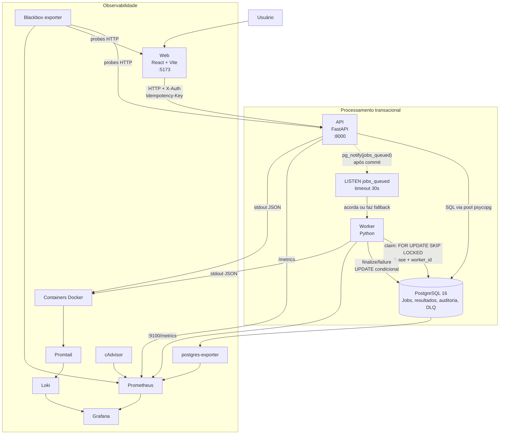
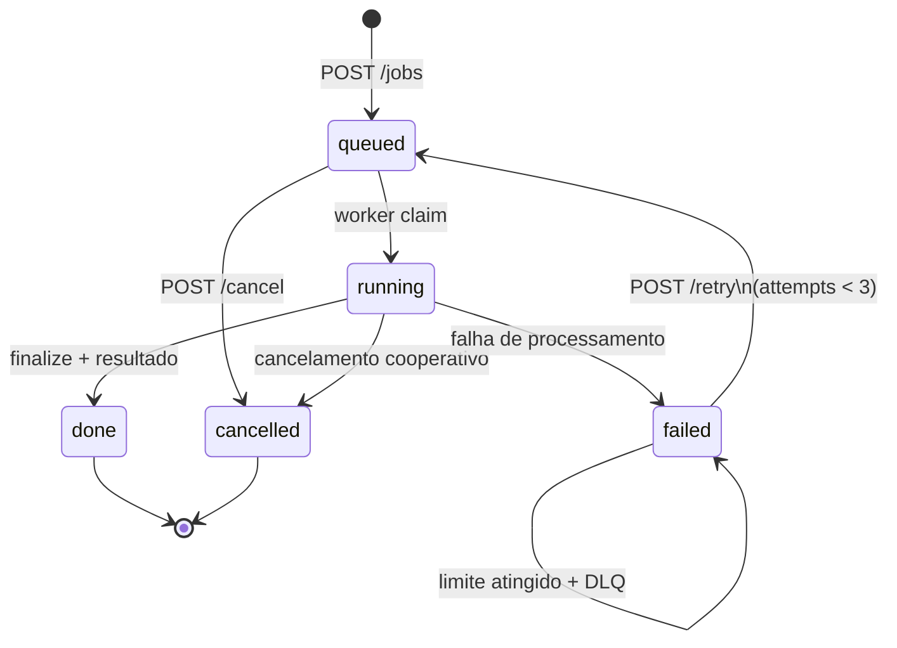

# Case Galaxies - Fullstack Senior

Implementação de um serviço multi-tenant para submissão e processamento assíncrono de jobs. A aplicação combina uma API FastAPI, um worker Python, PostgreSQL como fila durável e uma SPA React para acompanhar o ciclo de vida de cada job.

O resultado cobre isolamento por empresa, criação idempotente, cancelamento cooperativo, retry manual, DLQ, auditoria de eventos e observabilidade provisionada por código.

## Material original do case

Os documentos recebidos com o case foram preservados em [`docs/case/`](docs/case/). Eles descrevem a base inicial e devem ser lidos como contexto histórico; a implementação atual está documentada nas seções técnicas abaixo.

| Documento | Conteúdo |
|---|---|
| [README original](docs/case/README.md) | Contexto e requisitos iniciais da base entregue |
| [TASKS](docs/case/TASKS.md) | Features, regras e checklist de entrega |
| [KNOWN_ISSUES](docs/case/KNOWN_ISSUES.md) | Sintomas que deveriam ser investigados |
| [DECISIONS](docs/case/DECISIONS.md) | Registro de decisões, evidências e trade-offs da implementação |

## Executar a stack

**Pré-requisito:** Docker Desktop ou Docker Engine com o plugin `docker compose`.

```bash
docker compose up --build -d
docker compose ps
```

A API executa as migrations SQL antes de iniciar. Para carregar dados de demonstração:

```bash
docker compose --profile seed run --rm seed
```

Serviços disponíveis:

| Serviço | Endereço | Uso |
|---|---|---|
| Web | http://localhost:5173 | Interface da aplicação |
| API | http://localhost:8000 | API HTTP |
| OpenAPI | http://localhost:8000/docs | Contrato interativo da API |
| PostgreSQL | `localhost:5433` | Banco local (`relay` / `relay`) |
| Grafana | http://localhost:3000 | Dashboards, login `admin` / `admin` |
| Prometheus | http://localhost:9090 | Targets, métricas e regras |

Comandos operacionais úteis:

```bash
# Acompanhar inicialização e processamento
docker compose logs -f api worker

# Confirmar a saúde da API e os targets de métricas
curl http://localhost:8000/health
# Acesse http://localhost:9090/targets no navegador

# Recriar imagens e containers após alterações
docker compose up --build -d

# Encerrar a stack mantendo os volumes
docker compose down

# Encerrar e remover dados locais do PostgreSQL e Loki
docker compose down -v
```

## Testar

API e worker usam PostgreSQL efêmero via Testcontainers, portanto Docker precisa estar em execução.

```bash
(cd api && uv sync --frozen && uv run pytest -q)
(cd worker && uv sync --frozen && uv run pytest -q)
(cd web && npm ci && npm test && npm run build)
```

Checagens de qualidade Python:

```bash
(cd api && uv run ruff check . && uv run ruff format --check .)
(cd worker && uv run ruff check . && uv run ruff format --check .)
```

Cada serviço carrega somente seu próprio arquivo de ambiente local: `api/.env`, `worker/.env` ou `web/.env`. Use o respectivo `.env.example` como ponto de partida. O Compose não depende de `.env` na raiz.

## Como funciona

1. A web chama a API com um contexto de empresa simplificado no header `X-Auth`.
2. A API valida a requisição, persiste o job e o evento de auditoria na mesma transação.
3. Após o commit, a API publica um `pg_notify` para reduzir a latência de despertar do worker.
4. O worker reivindica jobs com `FOR UPDATE SKIP LOCKED`, processa fora do lock e finaliza de forma condicional.
5. A tabela `jobs` é a fila durável. `LISTEN/NOTIFY` é somente um wake-up; o polling de 30 segundos e o `drain()` no startup recuperam notificações perdidas ou backlog.

### System design



### Garantias principais

| Área | Decisão |
|---|---|
| Durabilidade | `jobs` permanece no PostgreSQL até sua transição final; notificações não carregam estado de negócio. |
| Concorrência | Vários workers podem consumir a fila com `SKIP LOCKED`, sem reivindicar a mesma linha. |
| Recuperação | Jobs `running` com lease vencida são recuperados; worker reiniciado drena o backlog antes de esperar notificações. |
| Idempotência | `Idempotency-Key` evita duplicação na criação; resultado e débito de quota são protegidos contra repetição. |
| Isolamento | Leitura e mutação de jobs são filtradas por `company_id`; recursos de outro tenant não expõem existência. |
| Auditoria | Eventos de submissão, cancelamento, retry, conclusão e falha são persistidos com ator e `trace_id`; o worker usa `system:worker`. |

### Ciclo de vida do job



## Contratos e documentação técnica

| Área | Documento |
|---|---|
| API, autenticação e endpoints | [docs/api.md](docs/api.md) |
| Worker, concorrência, leases e retry | [docs/worker.md](docs/worker.md) |
| Frontend e fluxos de UI | [docs/web.md](docs/web.md) |
| Métricas, logs, dashboards e alertas | [observability/README.md](observability/README.md) |
| Índice da documentação técnica | [docs/README.md](docs/README.md) |
| Guia local da API | [api/README.md](api/README.md) |
| Guia local do worker | [worker/README.md](worker/README.md) |
| Guia local do frontend | [web/README.md](web/README.md) |

## Estrutura

```text
api/             API FastAPI e runner de migrations
worker/          Consumidor assíncrono da fila
web/             SPA React
db/migrations/   Schema SQL versionado, aplicado exclusivamente pela API
observability/   Prometheus, Grafana, Loki, exporters e dashboards
```
