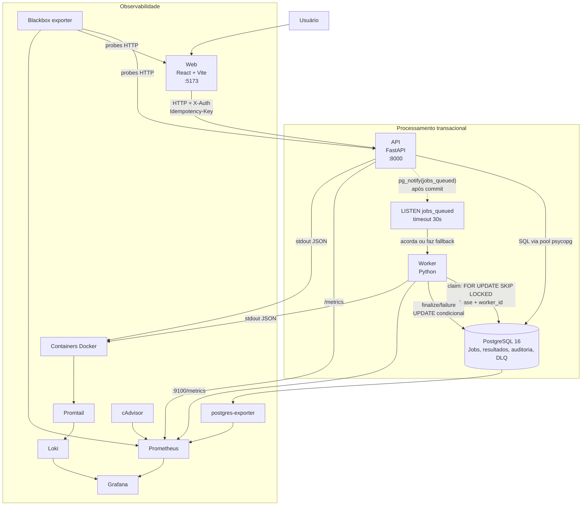
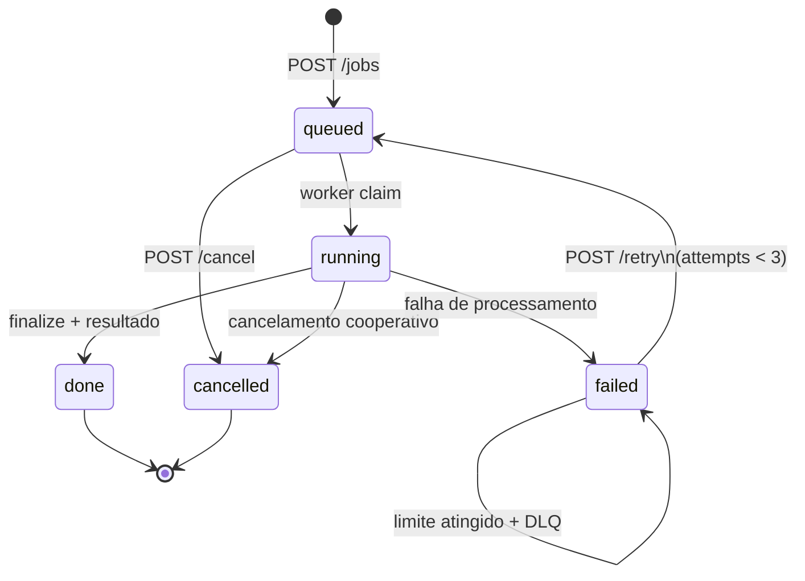
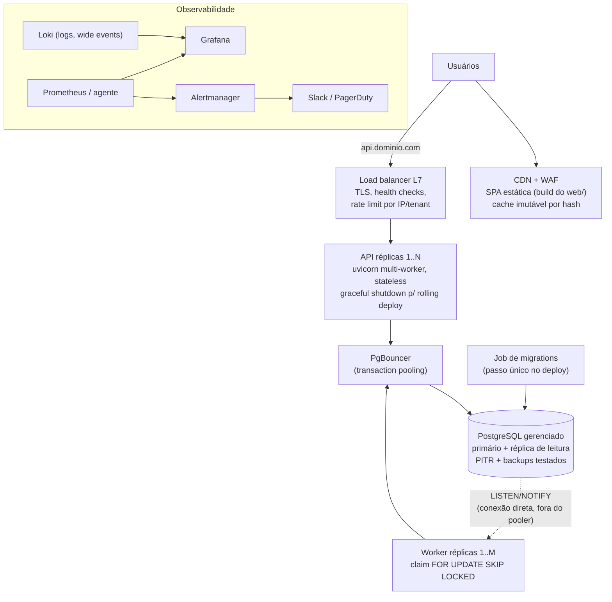

# Case Galaxies - Fullstack Senior

Implementação de um serviço multi-tenant para submissão e processamento assíncrono de jobs. A aplicação combina uma API FastAPI, um worker Python, PostgreSQL como fila durável e uma SPA React para acompanhar o ciclo de vida de cada job.

O resultado cobre isolamento por empresa, criação idempotente, cancelamento cooperativo, retry manual, DLQ, auditoria de eventos e observabilidade provisionada por código.

## Material original do case

Os documentos recebidos com o case foram preservados em [`docs/case/`](docs/case/). Eles descrevem a base inicial e devem ser lidos como contexto histórico; a implementação atual está documentada nas seções técnicas abaixo.

| Documento | Conteúdo |
|---|---|
| [README original](docs/case/README.md) | Contexto e requisitos iniciais da base entregue |
| [TASKS](docs/case/TASKS.md) | Features, regras e checklist de entrega |
| [KNOWN_ISSUES](docs/case/KNOWN_ISSUES.md) | Sintomas que deveriam ser investigados |
| [DECISIONS](docs/case/DECISIONS.md) | Registro de decisões, evidências e trade-offs da implementação |

## Executar a stack

**Pré-requisito:** Docker Desktop ou Docker Engine com o plugin `docker compose`.

```bash
docker compose up --build -d
docker compose ps
```

A API executa as migrations SQL antes de iniciar. Para carregar dados de demonstração:

```bash
docker compose --profile seed run --rm seed
```

Serviços disponíveis:

| Serviço | Endereço | Uso |
|---|---|---|
| Web | http://localhost:5173 | Interface da aplicação |
| API | http://localhost:8000 | API HTTP |
| OpenAPI | http://localhost:8000/docs | Contrato interativo da API |
| PostgreSQL | `localhost:5433` | Banco local (`relay` / `relay`) |
| Grafana | http://localhost:3000 | Dashboards, login `admin` / `admin` |
| Prometheus | http://localhost:9090 | Targets, métricas e regras |

Comandos operacionais úteis:

```bash
# Acompanhar inicialização e processamento
docker compose logs -f api worker

# Confirmar a saúde da API e os targets de métricas
curl http://localhost:8000/health
# Acesse http://localhost:9090/targets no navegador

# Recriar imagens e containers após alterações
docker compose up --build -d

# Encerrar a stack mantendo os volumes
docker compose down

# Encerrar e remover dados locais do PostgreSQL e Loki
docker compose down -v

# Carga de 20k jobs para reproduzir o benchmark de listagem (Sintoma 1)
docker compose exec -T db psql -U relay -d relay < db/populate_jobs.sql
```

## Testar

API e worker usam PostgreSQL efêmero via Testcontainers, portanto Docker precisa estar em execução.

```bash
(cd api && uv sync --frozen && uv run pytest -q)
(cd worker && uv sync --frozen && uv run pytest -q)
(cd web && npm ci && npm test && npm run build)
```

Checagens de qualidade Python:

```bash
(cd api && uv run ruff check . && uv run ruff format --check .)
(cd worker && uv run ruff check . && uv run ruff format --check .)
```

Cada serviço carrega somente seu próprio arquivo de ambiente local: `api/.env`, `worker/.env` ou `web/.env`. Use o respectivo `.env.example` como ponto de partida. O Compose não depende de `.env` na raiz.

O CI ([`.github/workflows/ci.yml`](.github/workflows/ci.yml)) roda em cada push/PR: lint (`ruff`) e type check (`pyright`) de API e worker, os testes dos três serviços e o build das imagens do Compose.

## Como funciona

1. A web chama a API com um contexto de empresa simplificado no header `X-Auth`.
2. A API valida a requisição, persiste o job e o evento de auditoria na mesma transação.
3. Após o commit, a API publica um `pg_notify` para reduzir a latência de despertar do worker.
4. O worker reivindica jobs com `FOR UPDATE SKIP LOCKED`, processa fora do lock e finaliza de forma condicional.
5. A tabela `jobs` é a fila durável. `LISTEN/NOTIFY` é somente um wake-up; o polling de 30 segundos e o `drain()` no startup recuperam notificações perdidas ou backlog.

### System design



### Garantias principais

| Área | Decisão |
|---|---|
| Durabilidade | `jobs` permanece no PostgreSQL até sua transição final; notificações não carregam estado de negócio. |
| Concorrência | Vários workers podem consumir a fila com `SKIP LOCKED`, sem reivindicar a mesma linha. |
| Recuperação | Jobs `running` com lease vencida são recuperados; worker reiniciado drena o backlog antes de esperar notificações. |
| Idempotência | `Idempotency-Key` evita duplicação na criação; resultado e débito de quota são protegidos contra repetição. |
| Isolamento | Leitura e mutação de jobs são filtradas por `company_id`; recursos de outro tenant não expõem existência. |
| Auditoria | Eventos de submissão, cancelamento, retry, conclusão e falha são persistidos com ator e `trace_id`; o worker usa `system:worker`. |

### Ciclo de vida do job



## Proposta para produção

Como este sistema iria para produção, agnóstico de provedor de cloud. O princípio é manter o desenho que o case prova — fila durável no Postgres, corridas arbitradas no banco, serviços stateless — e escalar cada camada de forma independente, com gatilhos ligados a métricas que a stack já expõe.



Decisões por camada:

- **Web**: o dev server do Vite não vai para produção. O build estático é servido por CDN com WAF na frente — cache imutável por hash de asset, custo mínimo e latência de borda. A CDN aqui se justifica porque a SPA é 100% estática; a API não passa por ela.
- **API**: stateless por desenho (contexto no header, sem sessão em memória), então escala horizontal atrás do LB é trivial. Cada réplica roda uvicorn com múltiplos processos. O graceful shutdown existente (503 + drain) é o que permite rolling deploy sem derrubar requests em andamento.
- **Conexões**: PgBouncer em transaction pooling entre API/worker e o banco. A lição do [caso da Shopify](https://shopify.engineering/scaling-inventory-reservations) que adotei como regra: sob carga, o gargalo escondido raramente é a query — é conexão presa. O pool da API já exporta `requests_waiting` e utilização exatamente para diagnosticar isso.
- **Banco**: PostgreSQL gerenciado com primário + réplica de leitura e PITR. Dashboards e consultas administrativas podem ler da réplica; a fila **não** — claim e transições exigem o primário. Detalhe real de operação: `LISTEN` não funciona atrás de PgBouncer em transaction mode, então cada worker mantém uma conexão direta ao primário só para o LISTEN (como já faz hoje) e o resto do tráfego passa pelo pooler.
- **Worker**: M réplicas competindo pela fila com `SKIP LOCKED` — já suportado e exercitado no benchmark (`WORKERS=N ./benchmark/run.sh`). NOTIFY continua sendo só o wake-up; o polling de 30s é a rede de segurança.
- **Migrations**: viram um passo único de deploy (job/init container) antes do rollout das réplicas, em vez do boot da API. A tabela `schema_migrations` já torna o passo idempotente.
- **Segredos**: `DATABASE_URL` e credenciais via secret manager do provedor, nunca em imagem ou repositório.

Regras de escala — cada gatilho usa uma métrica que já existe hoje:

| Camada | Gatilho | Métrica já exposta | Limite conhecido (medido) |
|---|---|---|---|
| API (réplicas) | p99 > 500ms sustentado ou fila no pool | `http_request_duration_seconds`, `api_db_pool_requests_waiting` | ~318 req/s por processo ([benchmark](benchmark/README.md)) |
| Worker (réplicas) | backlog crescendo ou espera de fila p99 acima do SLO | `pg_jobs_total{status="queued"}`, `job_queue_wait_seconds` | ~1 job/s por réplica (handler do case simula 1s) |
| Postgres | CPU > 60% sustentado, cache hit < 99%, dead tuples crescendo | postgres-exporter | vertical primeiro; depois particionar/arquivar `jobs` |
| DLQ | ≥ 1 entrada | `pg_dlq_total` | alerta para humano, nunca autoscaling |

Realidades que vão aparecer primeiro, na ordem:

1. **`count(*)` do `X-Total-Count`** cresce com o volume do tenant — a alavanca (cache, estimativa, header opcional) está registrada em [DECISIONS §7](docs/case/DECISIONS.md#7-próximos-passos-com-mais-tempo).
2. **Churn da tabela `jobs`**: fila via UPDATE gera dead tuples e pressão de autovacuum. Com milhões de jobs/dia, mover concluídos antigos para uma tabela de arquivo mantém a fila e seus índices pequenos — o mesmo princípio do pool limitado de linhas da Shopify.
3. **Um único Postgres é o teto final.** Antes de trocar por broker dedicado: escala vertical, réplicas de leitura e particionamento levam longe — e a troca por SQS/RabbitMQ está desenhada para não exigir reescrita (o worker só conhece claim/finalize).

## Contratos e documentação técnica

| Área | Documento |
|---|---|
| API, autenticação e endpoints | [docs/api.md](docs/api.md) |
| Worker, concorrência, leases e retry | [docs/worker.md](docs/worker.md) |
| Frontend e fluxos de UI | [docs/web.md](docs/web.md) |
| Métricas, logs, dashboards e alertas | [observability/README.md](observability/README.md) |
| Benchmark de carga (k6) e resultados | [benchmark/README.md](benchmark/README.md) |
| Índice da documentação técnica | [docs/README.md](docs/README.md) |
| Guia local da API | [api/README.md](api/README.md) |
| Guia local do worker | [worker/README.md](worker/README.md) |
| Guia local do frontend | [web/README.md](web/README.md) |

## Estrutura

```text
api/             API FastAPI e runner de migrations
worker/          Consumidor assíncrono da fila
web/             SPA React
db/migrations/   Schema SQL versionado, aplicado exclusivamente pela API
observability/   Prometheus, Grafana, Loki, exporters e dashboards
benchmark/       Cenários k6 de carga, populate SQL e resultados medidos
```
