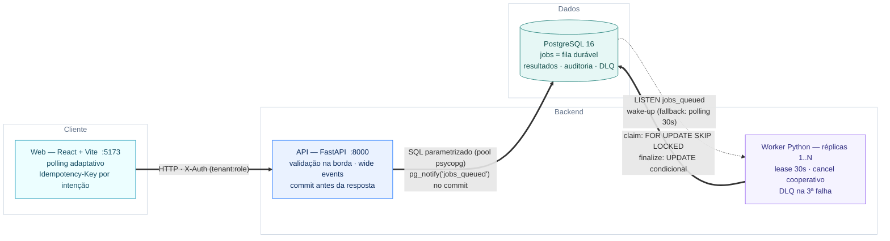
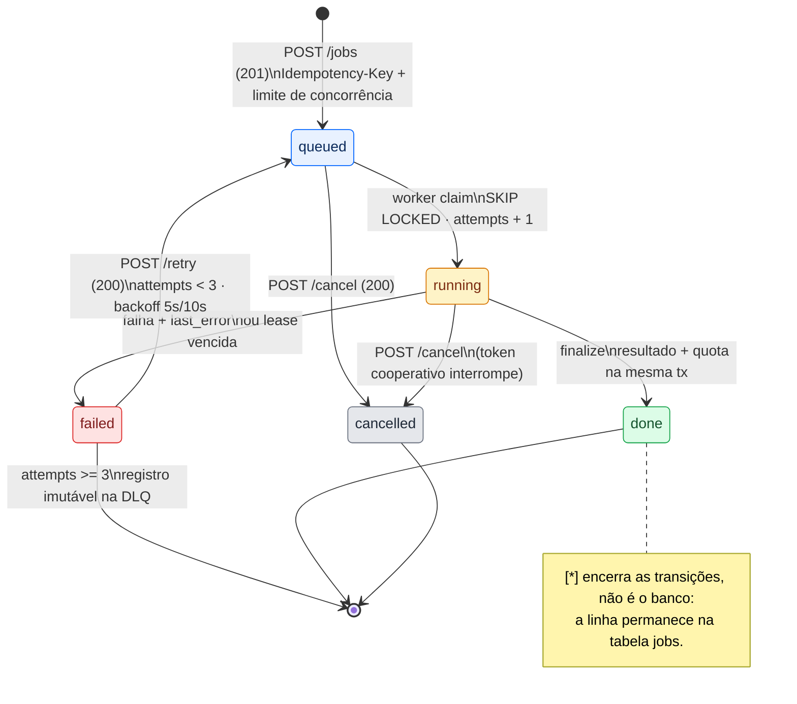
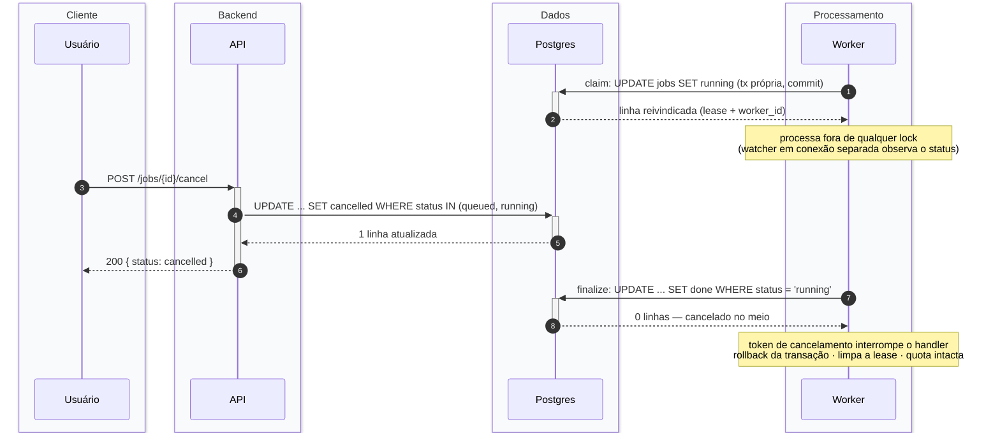
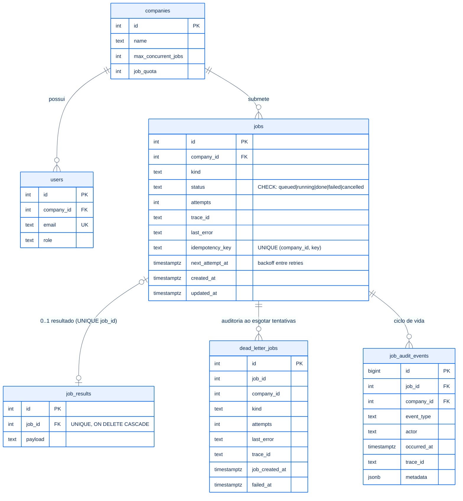

# Relay — Documentação

Serviço multi-tenant de processamento de jobs em background: empresas submetem
jobs pela API, um worker processa de forma assíncrona e os usuários acompanham
status e resultado pela web.

| Documento | Conteúdo |
|---|---|
| [api.md](api.md) | Endpoints, validação, camadas e regras de negócio da API |
| [worker.md](worker.md) | Ciclo de processamento, concorrência, retry e pub/sub |
| [web.md](web.md) | SPA React: estrutura, fluxos e integração com a API |
| [observability/README.md](../observability/README.md) | Métricas, logs e dashboards (Grafana, Prometheus, Loki) |
| [benchmark/README.md](../benchmark/README.md) | Carga com k6: cenários, resultados e análise de gargalo |

O [README raiz](../README.md) é o ponto de entrada operacional. O registro de
decisões, evidências e trade-offs está em
[docs/case/DECISIONS.md](case/DECISIONS.md); os demais arquivos de `case/`
preservam o enunciado original.

## System design

Pontos estruturais:

- **A tabela `jobs` é a fila.** LISTEN/NOTIFY é só o sinal de "chegou trabalho"
  (baixa latência); a durabilidade vem da tabela + transações. Notify perdido é
  coberto por polling de fallback (30s).
- **Isolamento por tenant** em toda leitura/mutação (`company_id` do `X-Auth`).
- **Concorrência resolvida no banco**: lock da company no create, `SKIP LOCKED`
  no claim, UPDATEs condicionais para cancel/retry, UNIQUE para idempotência.
- **Observabilidade por wide events**: um JSON por request/job, correlacionados
  por `trace_id` de ponta a ponta.

## Ciclo de vida de um job

O worker não reprocessa automaticamente uma falha. A primeira e a segunda falha
deixam o job em `failed`; o usuário ou uma integração deve chamar `POST /retry`.
O retry agenda o job para depois de 5 segundos na primeira repetição e 10
segundos na segunda. Ao atingir três tentativas, o job permanece em `failed` e
recebe uma entrada na DLQ.

## Corrida cancelar × finalizar (quem vence: quem escreve primeiro)

Se a ordem inverte (finalize primeiro), o cancel não casa linha e responde 409.
Sem deadlock: é sempre um lock de uma única linha.

Durante o processamento, o worker consulta o estado do job por uma conexão
separada. O handler recebe um token cooperativo e deve verificá-lo em pontos
seguros. Ao detectar cancelamento, o worker faz rollback da transação ativa,
limpa a lease e encerra apenas aquele job; o processo do worker continua
disponível para os próximos jobs.

## Modelo de dados

Migrations SQL versionadas em `db/migrations/*.sql`, aplicadas em ordem pelo
runner `shared/db/migrate.py` (tabela `schema_migrations`); o container da API
aplica antes de subir.
