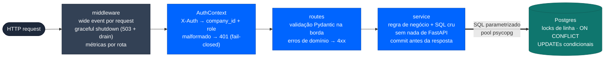

# API (FastAPI)

Serviço HTTP em `api/`, Python 3.12 + uv. Swagger em `http://localhost:8000/docs`
— Swagger UI brandado Galaxies servido por rota própria (`shared/http/docs.py`,
com `docs_url=None` no FastAPI).

## Arquitetura (monolito modular, package-by-feature)

```
api/
├─ main.py                     # montagem: lifespan, middleware, routers
├─ modules/
│  ├─ auth/context.py          # AuthContext (Pydantic) + dependency current_ctx
│  ├─ jobs/{routes,service,schemas,errors}.py
│  └─ admin/{routes,service}.py
├─ shared/
│  ├─ config/                  # env loader + Settings (Pydantic, validada no boot)
│  ├─ db/                      # pool psycopg tipado + runner de migrations
│  ├─ http/                    # graceful_shutdown.py + docs.py (Swagger brandado)
│  ├─ logging/wide_event.py    # 1 evento JSON por request
│  └─ observability/           # api_metrics.py (Prometheus, exposto em /metrics)
└─ tests/                      # espelha a estrutura; roda em Postgres via testcontainers
```

Camadas: **route** (HTTP: validação Pydantic, tradução erro de domínio → status)
→ **service** (regra de negócio + SQL cru, sem nada de FastAPI) → **Postgres**
(pool `psycopg_pool`, rows como dict, `Connection[DictRow]`).



## Autenticação

Header `X-Auth: <company_id>:<role>` (simplificação do case, sem assinatura).
Validado pelo `AuthContext`: id inteiro > 0 e role pertencente a `user` ou
`admin` — credencial ausente ou malformada → 401.
Eventos de auditoria registram o principal canônico (`company_id:role`) e o
`trace_id`. Como o header é uma simplificação sem assinatura, ele não identifica
um usuário individual; em produção, o `actor` deve vir de um token assinado.
Todas as queries de job usam o `company_id` do contexto: recurso de outro
tenant responde **404** (não vaza existência).

## Endpoints

| Método/Rota | Descrição | Erros |
|---|---|---|
| `GET /jobs?limit&offset&status&search` | Lista paginada da empresa (default 50, máx 200), com `result_count`, filtro por `status`, busca por `kind` e total no header `X-Total-Count` | 401, 422 |
| `GET /jobs/{id}` | Status, attempts, last_error e eventos de auditoria | 401, 404, 422 |
| `GET /jobs/{id}/result` | Payload do resultado | 401, 404 |
| `POST /jobs` | Cria job `queued` (**201**); exige `Idempotency-Key`; respeita `max_concurrent_jobs` (lock na company) | 401, 422, 429 |
| `POST /jobs/{id}/cancel` | Cancela `queued`/`running` (UPDATE condicional atômico) | 401, 404, 409 |
| `POST /jobs/{id}/retry` | Reenfileira `failed` com `attempts < 3` | 401, 404, 409 |
| `GET /admin/jobs` | Todos os jobs, todas as empresas — exige role `admin` | 401, 403 |
| `GET /admin/dlq` | Dead letter queue paginada (jobs que esgotaram tentativas) — exige role `admin` | 401, 403 |
| `GET /metrics` | Métricas Prometheus da API | — |

### Idempotência no create

`POST /jobs` exige o header **`Idempotency-Key`** (1–200 chars; 422 se ausente).
Replay (mesma empresa + mesma chave) devolve o job original: sem linha nova,
sem novo NOTIFY, sem cobrar de novo o limite de concorrência. Garantido por
índice único parcial `(company_id, idempotency_key)` + `ON CONFLICT DO NOTHING`.

### Validação (estilo Zod)

Pydantic valida tipo/formato/faixa na borda e responde `422` com o campo
apontado (`{"type": "string_type", "loc": ["body", "kind"]}`). Não há coerção
silenciosa (int onde era string → 422). Limites: `kind` 1–100 chars
(com `strip_whitespace`: `"  report  "` vira `"report"`, `"   "` é rejeitado),
`Idempotency-Key` 1–200 chars (idem), `limit` 1–200, `offset ≥ 0`,
`status` restrito aos 5 valores válidos, `job_id ≥ 1`.
Roles fora da whitelist (`user`/`admin`) são rejeitadas como credencial
inválida (401, fail-closed) — não como falta de permissão.

### Contrato OpenAPI

| Item | Obrigatório | Onde |
|---|---|---|
| `X-Auth` | **sim** — securityScheme aplicado às 8 operações (botão *Authorize* no Swagger) | header, todas as rotas |
| `Idempotency-Key` | **sim** | header, apenas `POST /jobs` |
| `job_id` | **sim** (`≥ 1`) | path, rotas de job |
| corpo `NewJob` | **sim** | body, `POST /jobs` |
| `limit`/`offset` | não (default 50/0, faixa 1–200 e ≥ 0) | query, rotas paginadas |
| `status`/`search` | não (enum do domínio / 1–100 chars) | query, `GET /jobs` |

Campos `nullable` (`last_error`, `trace_id`, `job_id`, `job_created_at`) são
**sempre presentes** na resposta — o que varia é o valor ser `null`, e o
schema reflete isso (`required` + `anyOf: [tipo, null]`), para clientes
gerados não tratarem a chave como ausente. `status` nunca é string livre: nas
leituras e no create é o enum dos 5 estados (o replay de `Idempotency-Key`
devolve o job original, que pode já ter sido processado); em cancel e retry é
o único valor possível (`const`).
O header `X-Total-Count` está documentado nas três rotas paginadas.
Testes de contrato (`TestR12OpenApiContract`) falham se algo disso regredir.

Os eventos de auditoria retornados no detalhe são `submitted`, `cancelled`,
`retry_requested`, `completed` e `failed`. Os três primeiros carregam o
principal do `X-Auth`; transições realizadas pelo worker usam
`system:worker`. Todos preservam o `trace_id` do job.

### Documentação interativa

`/docs` serve um Swagger UI com a identidade da Galaxies (wordmark no topo,
paleta e tipografia da marca) e o **mesmo favicon do front** — o arquivo é
servido em `/favicon.png` a partir de `api/static/favicon.png`, cópia
byte-a-byte de `web/public/galaxies-icon.png` (há teste comparando os bytes).

## Ciclo de vida da aplicação

- **Startup**: migrations SQL aplicadas antes do uvicorn (no Docker).
- **Request**: middleware abre um *wide event* (request_id, método, path),
  handlers enriquecem (company_id, job_id, limites) e o evento é emitido uma
  única vez no fim — erros e requests lentas sempre logam; sucessos são
  amostrados (`LOG_SUCCESS_SAMPLE_RATE`).
- **Shutdown** (SIGTERM): para de aceitar (503 + `Connection: close`), drena as
  requests em andamento (timeout 30s) e fecha o pool.

## Configuração (env)

| Variável | Default | Uso |
|---|---|---|
| `DATABASE_URL` | — (obrigatória) | Conexão Postgres |
| `DB_POOL_SIZE` / `DB_MAX_OVERFLOW` | 5 / 10 | Tamanho do pool |
| `DB_POOL_TIMEOUT_S` / `DB_POOL_RECYCLE_S` | 30 / 1800 | Espera e reciclagem |
| `CORS_ORIGINS` | `http://localhost:5173` | Allowlist de origens (separadas por vírgula) |
| `LOG_SLOW_THRESHOLD_MS` | 1000 | Acima disso, sempre loga |
| `LOG_SUCCESS_SAMPLE_RATE` | 1.0 | Amostragem de sucessos |
| `LOG_SUPPRESS_PROBE_ROUTES` | false (o Compose liga por padrão) | Não emite logs de sucesso de `/metrics`, probes de health/readiness/liveness, `/docs`, `/openapi.json` e `/favicon.png` |
| `MIGRATIONS_DIR` | `../db/migrations` | Diretório das migrations |

Validadas no boot por `shared/config/settings.py` (falha cedo com erro claro).

## Testes

`uv run pytest` (requer Docker): Postgres 16 efêmero via testcontainers,
migrations reais, truncate entre testes. Cobrem rotas, services, integração
(fluxos completos e entradas inesperadas), auth, shutdown e logging, além de
duas suítes específicas:

- `tests/integration/test_race_conditions.py` — concorrência real com threads
  (limite de concorrência, duplo-clique, chave de idempotência em corrida) e
  quebra direta das constraints no banco.
- `tests/integration/test_business_rules_break.py` — bateria adversarial: cada
  teste tenta violar uma regra de negócio com input errado, faltando ou
  malicioso (auth, idempotência, tenant, roles, transições, limites, injeção,
  abuso de protocolo).
