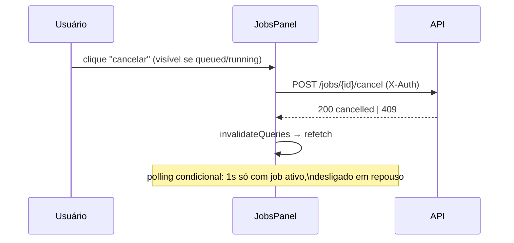

# Web (React SPA)

SPA em `web/`: React 18 + Vite + TanStack Query. Sem estado global além do
cache de queries. Identidade visual da Galaxies (paleta azul, ícone) com
componentes leves em CSS puro — sem lib de UI — e toasts para feedback de
todas as ações (sucesso, erro com o `detail` real da API).

## Estrutura

Organizado em **atomic design** — componentes pequenos, reutilizáveis e sem
`any` (strict mode):

```
web/src/
├─ main.tsx / App.tsx        # bootstrap e composição da página
├─ types.ts                  # tipos de domínio (Job, JobDetail, JobsPage...)
├─ api.ts                    # client genérico tipado (get<T>/post<T>, ApiError,
│                            #   fetchJobsPage lê X-Total-Count)
├─ auth.ts                   # usuários fake + labels amigáveis
├─ toast.tsx                 # ToastProvider/useToast (vidro fosco)
├─ styles.css                # tipografia do site Galaxies (DM Sans + Inter)
├─ hooks/useDelayedLoading.ts  # skeleton visível por >= 200ms (sem flash)
└─ components/
   ├─ atoms/       Button, Badge, Select (chevron custom), Card, Skeleton, Logo
   ├─ molecules/   AuthSwitcher, FilterBar (filtro por status + busca por kind),
   │               Pagination (tamanho da página + total), JobRow, JobDetailPanel
   └─ organisms/   Header, JobsPanel, SubmitButton, AdminPanel
```

## Cobertura das rotas da API

| Rota | Onde na UI |
|---|---|
| `GET /jobs` | Listagem paginada (tamanho selecionável, default 10, «Anterior/Próxima») com polling adaptativo, filtro por status e busca (`FilterBar`) |
| `GET /jobs/{id}` | Clique no nome do job → painel expandido (tentativas, último erro e auditoria) |
| `GET /jobs/{id}/result` | Mesmo painel: payload do resultado (ou "ainda sem resultado") |
| `POST /jobs` | Botão "Novo job" (Idempotency-Key, disable, toast) |
| `POST /jobs/{id}/cancel` | Botão "Cancelar" em queued/running |
| `POST /jobs/{id}/retry` | Botão "Tentar de novo" em failed |
| `GET /admin/jobs` | Card "Visão administrativa" (só para role admin) |

Layout responsivo (breakpoint 600px): header empilhado, linhas com wrap e
toasts ancorados na base em telas pequenas.

## Fluxos



- **Autenticação fake**: o dropdown troca o header `X-Auth` (`1:user`,
  `2:admin`...); a visão admin só aparece para role `admin` (e o backend
  também exige — 403).
- **Submissão idempotente**: `SubmitButton` gera um `Idempotency-Key`
  (`crypto.randomUUID`) por *intenção* e só renova após sucesso — duplo-clique
  ou retry de rede replay-a o mesmo job em vez de duplicar.
- **Ações por estado**: cancelar aparece em `queued`/`running`; retry em
  `failed`. Ambas invalidam a query de jobs ao concluir.

## Tipagem

`Job` tipado em `types.ts` (status como union literal); `tsc --noEmit`
roda no CI. `src/vite-env.d.ts` habilita os tipos de `import.meta.env`.

## Executar

```bash
npm install
npm run dev        # http://localhost:5173 (VITE_API_URL aponta para a API)
npx tsc --noEmit   # typecheck
```
