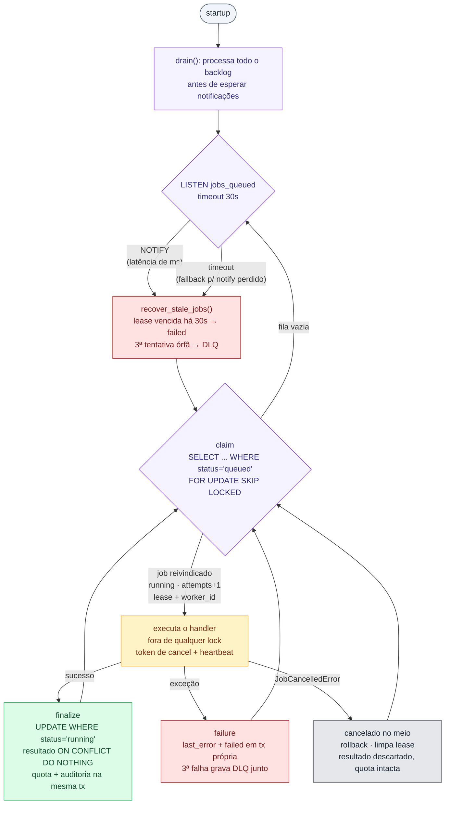

# Worker

Processo Python (`worker/`) que consome a fila de jobs. Sem HTTP — conversa só
com o Postgres. Mesmo layout modular da API (`modules/`, `shared/` espelhados).

## Loop principal



O LISTEN/NOTIFY vive em `modules/jobs/listener.py`: o `pg_notify` emitido pela
API no create/retry acorda o worker imediatamente
(latência ~1s, dominada pelo processamento); o timeout de 30s garante progresso
se um notify se perder (LISTEN/NOTIFY não tem entrega garantida sem listener).

## Processamento em duas fases (`modules/jobs/processor.py`)

1. **Claim** (transação própria): `SELECT ... WHERE status='queued' ORDER BY id
   LIMIT 1 FOR UPDATE SKIP LOCKED` → `UPDATE SET running, attempts+1` → commit.
   `SKIP LOCKED` permite N réplicas sem processar o mesmo job duas vezes
   (`docker compose up -d --scale worker=N`; validado no
   [benchmark](../benchmark/README.md): a 3 jobs/s, 1 réplica satura e 4
   seguram e2e p95 em 1,5s).
2. **Trabalho** fora de qualquer lock (não bloqueia cancel).
3. **Finalize** (transação própria): `UPDATE ... SET done WHERE status='running'`.
   - 0 linhas → o job foi **cancelado no meio**: resultado descartado, quota intacta.
   - 1 linha → `INSERT job_results ... ON CONFLICT (job_id) DO NOTHING`; a quota
     só é debitada se o insert realmente aconteceu (idempotente em retry).

Durante o trabalho, uma conexão separada monitora o status do job. O handler
somente começa depois de o monitor confirmar, dentro de um tempo limitado,
`LISTEN` + commit + releitura do status. Se o monitor não ficar pronto ou cair
durante a execução, o worker falha fechado: interrompe o token e registra a
causa em `last_error`, sem executar ou continuar trabalho sem supervisão. O
handler recebe o token cooperativo e deve verificá-lo em pontos seguros. Ao
detectar um cancelamento real da API, lança `JobCancelledError`, faz rollback
da transação ativa, limpa `locked_at`/`worker_id` e encerra somente o job atual.
O processo continua vivo para processar a fila restante. Handlers que executem
operações externas devem aplicar compensação própria, pois operações já
commitadas fora da transação do job não podem ser desfeitas pelo PostgreSQL.

## Falhas, retry com backoff e DLQ

Exceção durante o trabalho → rollback do parcial e, em transação própria,
persiste `last_error` e marca o job como `failed`. O worker não agenda retry
automático: o retry é disparado por `POST /jobs/{id}/retry`. O ciclo completo,
com **máximo de 3 tentativas** (`MAX_ATTEMPTS`), é:

| Tentativa que falhou | Próximo passo | Espera antes do retry |
|---|---|---|
| 1ª | `failed`, aguardando retry manual | o retry agenda 5s |
| 2ª | `failed`, aguardando retry manual | o retry agenda 10s |
| 3ª | `failed` + **DLQ** | — |

O agendamento do retry manual usa `jobs.next_attempt_at`: o claim ignora jobs
com retry no futuro (`WHERE next_attempt_at IS NULL OR next_attempt_at <= now()`).
O endpoint `POST /jobs/{id}/retry` limpa o erro, reenfileira o job e aplica
backoff exponencial de 5s na primeira repetição e 10s na segunda. Uma nova
tentativa concorrente não cria outro job: a transição condicional
`failed → queued` faz a segunda chamada retornar `409`.

**Dead Letter Queue** (`dead_letter_jobs`, migration `0006`): ao esgotar as
tentativas, o worker grava — na mesma transação da falha — um registro
imutável de auditoria com `job_id`, `company_id`, `kind`, `attempts`,
`last_error`, `trace_id` e timestamps. As colunas são desnormalizadas de
propósito: a auditoria sobrevive a expurgo de jobs. Consumo:

- `GET /admin/dlq` (role admin) — listagem paginada com todos os detalhes;
- dashboard **DLQ** no Grafana — contagem, tempo desde a última entrada e a
  tabela completa (datasource Postgres read-only);
- stat "DLQ" no **Overview** (fica vermelho com ≥ 1 entrada);
- wide event `dead_lettered: true` com o `trace_id` de ponta a ponta.

## Observabilidade

Um wide event JSON por job processado:

```json
{"service":"worker","event":"job_processed","job_id":28,"company_id":2,
 "job_kind":"report","trace_id":"265a81a8-...","attempts":1,"outcome":"done",
 "duration_ms":1011.0,"level":"info"}
```

`outcome`: `done` | `cancelled` | `failed`. Erros sempre logam (tail sampling).

Além dos wide events, o worker expõe **métricas Prometheus** em `:9100`
(configurável via `METRICS_PORT`; definidas em
`shared/observability/worker_metrics.py`): espera na fila, duração, outcomes e
wakeups — jobs por status vêm do postgres-exporter, não do worker (ver
`observability/README.md`).

O worker também registra os eventos de auditoria `completed` e `failed` na
mesma transação que altera o status do job, incluindo recuperações de lease.
O ator desses eventos é `system:worker`; submissão, cancelamento e retry são
registrados pela API com o principal autenticado.

## Executar e testar

```bash
uv run main.py     # local (usa worker/.env; Postgres em localhost:5432)
uv run pytest      # testcontainers: claim, falha, retry, cancel mid-flight, NOTIFY
```
