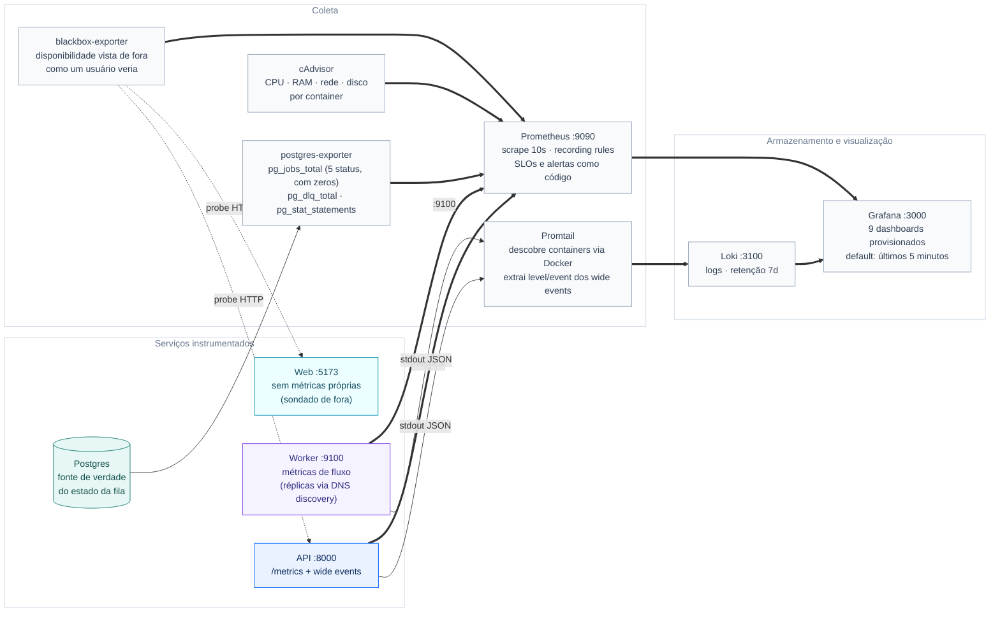

# Observability — métricas, logs e dashboards

Stack completa de observabilidade do Relay, provisionada por código. Nada é
configurado manualmente: datasources e dashboards já nascem prontos.

## Como subir

A observabilidade é **opcional** e vive atrás do profile `obs` do Compose — o
`docker compose up --build` padrão sobe só a aplicação (db, api, worker, web,
seed), mantendo o contrato mínimo do case. Para subir tudo com a stack de
observabilidade:

```bash
# aplicação + observabilidade (7 serviços extras)
docker compose --profile obs up --build -d

# adicionar a observabilidade a uma stack que já está no ar
docker compose --profile obs up -d

# encerrar incluindo os serviços do profile (e -v para limpar o volume do Loki)
docker compose --profile obs down
```

Serviços do profile: Prometheus, Grafana, Loki, Promtail, postgres-exporter,
blackbox-exporter e cAdvisor (este roda `privileged` com o socket do Docker
montado — é o custo de coletar CPU/RAM/rede por container; em macOS ele mede a
VM do Docker Desktop). A API e o worker expõem `/metrics` sempre, com ou sem o
profile — o profile só liga quem coleta e visualiza.

## Arquitetura



## Acessos

| Ferramenta | URL | Observação |
|---|---|---|
| Grafana | http://localhost:3000 | Login `admin` / `admin` — dashboards na pasta **Relay** |
| Prometheus | http://localhost:9090 | Targets em `/targets` |
| Loki | interno (`loki:3100`) | Consumido pelo Grafana (datasource provisionado) |

## Métricas por serviço

### API (`/metrics` nativo, prometheus_client)

- `http_request_duration_seconds` — **histograma** por `method`, `route`
  (template da rota, não o path cru — cardinalidade controlada) e `status`.
  Alimenta os percentis **p50 / p75 / p99** via `histogram_quantile`.
- `http_requests_in_flight` — gauge de requests em andamento.
- `jobs_created_total` — contador de jobs criados. Sem label `kind`
  deliberadamente: é input do usuário (cardinalidade não-limitada).
- `api_db_pool_size`, `api_db_pool_available`, `api_db_pool_max` — estado do
  pool de conexões da API.
- `api_db_pool_requests_waiting` — requests bloqueadas aguardando conexão.
- `api_db_pool_utilization_ratio` — utilização do pool, útil para separar
  gargalo de banco de gargalo de capacidade da API.

### Worker (`:9100`, prometheus_client)

- `job_queue_wait_seconds` — histograma do tempo entre enfileirar e o worker
  reivindicar (latência de fila, o que o usuário sente antes do processamento).
- `job_processing_duration_seconds` — histograma por `outcome`
  (`done`/`cancelled`/`failed`), com percentis no dashboard.
- `jobs_processed_total` — contador por outcome (taxa de falha derivada).
- Estado da fila (`pg_jobs_total{status}`) vem do **postgres-exporter** via query custom — verdade no momento do scrape, independente do loop do worker. A query emite os 5 status sempre, com valor 0 incluído (sem isso, fila vazia viraria "No data" no painel em vez de 0).
- O scrape do worker usa **DNS discovery** (`dns_sd_configs`): com `docker compose up -d --scale worker=N`, cada réplica entra como target automaticamente.
- DLQ: `pg_dlq_total` e `pg_dlq_seconds_since_last` (exporter) + tabela completa no dashboard **DLQ**.
- `worker_wakeups_total{reason}` — NOTIFY vs timeout (saúde do pub/sub).

### Database (postgres-exporter)

Conexões por estado, transações commit/rollback, cache hit ratio, tuplas — o
dashboard **Database** cobre o essencial de saúde do Postgres.

`pg_stat_statements` é habilitado no PostgreSQL pela migration
`0011_pg_stat_statements.sql`. O exporter publica o top 50 por `queryid`,
tempo total/médio, chamadas e blocos lidos. O dashboard **Performance
Investigation** complementa isso com a query SQL completa e uma tabela de
queries bloqueadas/bloqueadoras via datasource Postgres.

### Containers (cAdvisor)

O cAdvisor coleta CPU, memória residente, limite de memória, rede e ciclo de
vida dos containers. O dashboard **Resources** permite identificar saturação de
CPU, vazamento de memória e tráfego anormal por serviço. Em Docker Desktop, a
visibilidade de nomes de containers pode depender do backend; em Linux com
Docker, os labels padrão do cAdvisor são usados.

### Web e disponibilidade (blackbox-exporter)

O web é um SPA servido pelo Vite — não expõe métricas próprias; a visão de
disponibilidade vem de **health checks HTTP externos** (o blackbox-exporter
acessa `web:5173` e `api:8000/docs` de fora, como um usuário faria, e reporta
`probe_success` = está no ar e `probe_duration_seconds` = tempo de resposta). As interações do usuário aparecem nos logs da API
(toda ação da UI vira request com wide event).

## Logs (Loki + Promtail)

> **Ruído de scrape:** com `LOG_SUPPRESS_PROBE_ROUTES=true` (**ligado por
> padrão no Compose**; desligue exportando a variável como `false`), as
> requests de `/metrics`, das rotas de health e de `/docs`/`/openapi.json`/
> `/favicon.png` (sondadas pelo blackbox a cada scrape) somem do
> stream quando respondem OK. São **dois canais** e a flag governa os dois: o
> wide event JSON (filtrado no middleware) e o access log em texto do uvicorn
> (filtrado no logger `uvicorn.access` — sem isso, linhas como
> `INFO: "GET /health HTTP/1.1" 200 OK` continuariam dominando o Grafana, já
> que o healthcheck do container e o Prometheus batem a cada 10s).
> Falhas nessas rotas continuam logando: é justamente quando o log importa.


Todos os containers logam em stdout; o Promtail descobre via Docker e envia ao
Loki com labels `service`/`container`. Como API e worker emitem **wide events**
(um JSON por request/job), o pipeline extrai `level` e `event` como labels —
no Grafana dá para filtrar `{service="api", level="error"}` e correlacionar
com o job pelo `trace_id` presente em cada linha.

## Dashboards provisionados (pasta Relay)

Todos os dashboards abrem com janela padrão de **últimos 5 minutos**. API,
Worker e Database têm uma linha "Recursos do container" (CPU, memória
residente, rede e disco via cAdvisor) para correlacionar sintoma de aplicação
com consumo de máquina sem trocar de dashboard.

| Dashboard | Conteúdo |
|---|---|
| **Overview** | Visão única: stats no topo (health check, RPS, p99, fila, jobs/s, conexões) + seções API, Worker, Database e Logs |
| **API** | p50/p75/p99 por rota, RPS por rota+status, taxa de 5xx, in-flight, jobs criados/s + recursos do container |
| **Worker** | espera na fila e processamento (p50/p99), throughput por outcome, taxa de falha, backlog, jobs por status, wakeups NOTIFY vs timeout + recursos do container |
| **Database** | conexões, utilização, locks, deadlocks, cache hit, tamanho, health checks externos, **estado atual** (stats: conexões, tamanho, cache hit, locks, fila) + recursos do container |
| **Logs** | stream de wide events (api+worker) e taxa de eventos de erro por serviço |
| **DLQ** | Dead Letter Queue auditável: contagem, recência e tabela completa (`dead_letter_jobs`) via datasource Postgres read-only |
| **Performance Investigation** | Pool da API, top queries por tempo, queries lentas via `pg_stat_statements`, stat "queries bloqueadas agora" (a tabela de bloqueios vazia mostra "No data", que aqui significa zero) |
| **Resources** | CPU, memória e rede por container via cAdvisor |
| **SLOs & Alerts** | Disponibilidade, latência abaixo de 1s, sucesso do worker e alertas ativos — os ratios respondem 100% em janela sem tráfego (guarda contra 0/0 = NaN) |

## Alertas e Notificações

As regras estão em `prometheus/alerts.yml` e são avaliadas pelo Prometheus a
cada 30 segundos. Cada regra possui uma janela `for`, para evitar alertas por
oscilações breves. O estado pode ser consultado em:

- Prometheus: `http://localhost:9090/alerts`
- Grafana: dashboard **SLOs & Alerts**, painel **Alertas ativos**
- API do Prometheus: `/api/v1/rules` e `/api/v1/alerts`

O stack atual **não envia notificações externas**. Não há Alertmanager, e-mail,
Slack, PagerDuty ou webhook configurado. Portanto, `firing` significa que o
alerta está detectado e visível no Prometheus/Grafana, não que alguém recebeu
uma mensagem.

Para produção, a próxima camada é adicionar Alertmanager com receivers
configurados por secret manager, por exemplo:

```text
Prometheus → Alertmanager → Slack / PagerDuty / e-mail / webhook
```

O Alertmanager deve receber os grupos `severity`/`service`, aplicar deduplicação
e agrupamento, enviar notificações de firing e recovery e manter uma rota de
silenciamento durante manutenções. URLs, tokens e credenciais não devem ser
versionados neste repositório.

## Decisões

- **Histogramas, não summaries**: percentis agregáveis entre réplicas no
  Prometheus (`histogram_quantile` sobre `rate` dos buckets).
- **Labels de baixa cardinalidade apenas** (route template, status, outcome);
  nada de IDs ou input de usuário em label.
- **Pull model** (Prometheus scrape a cada 10s) e retenção de logs de 7 dias no
  Loki — suficiente para o case, ajustável em `loki-config.yml`.
- Tudo **provisionado por arquivo** (datasources, dashboards, scrape configs):
  reproduzível em qualquer máquina com um único comando.
- **SLOs e alertas como código**: regras Prometheus para p99, disponibilidade,
  pool saturado, backlog, espera da fila, conexões e deadlocks.
